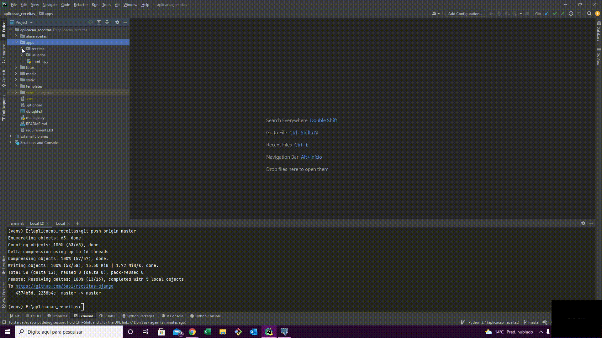

 <!-- Explicação do projeto -->
<h1 align="center">Receitas-django</h1>

	

 Desenvolvimento de um Web App de receitas usando o framework Django 

 <!-- Status do projeto -->
<h4 align="center"> 
	🚧  Django App ✔ Finalizado!  🚧
</h4>

<!-- Indice -->

 <a href="#objetivo">Objetivo</a> •
 <a href="#roadmap">Roadmap</a> • 
 <a href="#tecnologias">Tecnologias</a> • 
 <a href="#contribuicao">Contribuição</a> • 
 <a href="#licenc-a">Licença</a> • 
 <a href="#autor">Autor</a>

<!-- Tecnologias envolvidas -->

	<h2 align="center"> 🛠 Tecnologias envolvidas</h2>
	<ul>
		<li><a href="https://www.python.org/"  target="_blank">Python</a></li>
		<li><a href="https://www.djangoproject.com/"  target="_blank">Django</a></li>
		<li><a href="https://www.postgresql.org/"  target="_blank">PostgreSQL</a></li>                                       
	</ul>

<!-- Requirements -->

<h2 align="center"> Pré-requisitos </h2>
	
$ pip install requirements.txt

	
$ Instalação e configuração do banco de dados  - PostgreSQL

<!-- Resultados -->
<!-- Resultado banco de dados -->

	<h2 align="center">>Resultado banco de dados</h2>

	

<!-- Resultado parcial -->

	<h2 align="center">>Resultado da aplicação criada - Parte 1 </h2>

	

<!-- Resultado parcial -->	

	<h2 align="center"> Resultado da aplicação criada - Parte 2</h2>
	<h4 align="center">Autenticação no Django3 </h4>
	
Filtros, busca e Admin 

	

<!-- Resultado parcial -->	

	<h2 align="center"> Resultado da aplicação criada - Parte 3</h2>
	<h4 align="center">Autenticação no Django3 </h4>
	
Formulários de Cadastro e Login 

	
Requisições e Autenticações 

	
Mensagens de Erro e Sucesso 

	

<!-- Resultado parcial -->	

	<h2 align="center"> Resultado da aplicação criada - Parte 4</h2>
	<h4 align="center">Boas práticas </h4>
	
Criação de pastas para Apps e views 

	

<!-- Resultado parcial -->	

	<h2 align="center"> Resultado da aplicação criada - Parte 4 - final</h2>
	<h4 align="center">Paginação </h4>
	
Limitação de exibição de intens por página e passagem de páginas 

	
Editar e excluir receitas com usuário logado 

	

   

